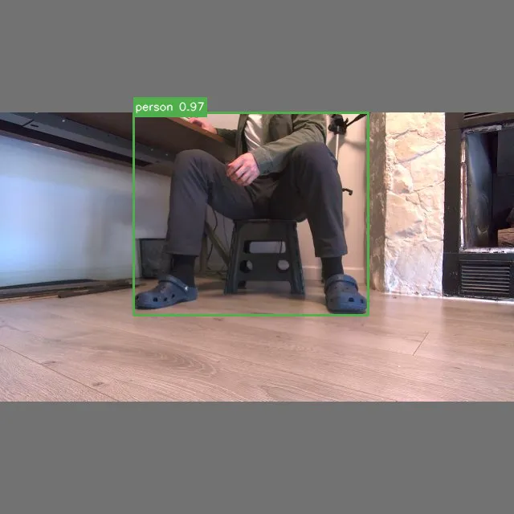

# Omniseer

[](https://github.com/jburo1/omniseer/actions/workflows/ci.yml)
[](https://jburo1.github.io/omniseer/)

<b>Physical edge AI for open-vocabulary perception and autonomous target acquisition on RK3588.</b>

Omniseer is a holonomic 4WD robot for developing and evaluating neural perception under real hardware constraints. It runs open-vocabulary YOLO-World on a ROCK 5B+ NPU through a native C++ V4L2 → RGA → RKNN pipeline, feeds detections into bounded visual autonomy, and records complete physical runs with model provenance, latency, telemetry, detections, video, and control traces. It is controlled through a operator application running on a remote machine, which parameterizes, launches, and synchronizes experiments  between the onboard SBC and remote computer.

The project spans the deployment loop from model conversion and quantization → hardware-accelerated inference → ROS 2 integration/Gazebo simulation → physical autonomy → profiling, controlled experiments, and failure analysis.

<p align="center">
  
</p>

<table align="center">
  <tr>
    <td></td>
    <td></td>
    <td></td>
  </tr>
</table>


## What the Robot Does

An operator specifies a target such as person, backpack, or another open-vocabulary class. Omniseer then executes a simple closed-loop perception-and-control behavior on the physical robot:

```
specify target
    ↓
scan the environment
    ↓
acquire a stable neural detection
    ↓
center the target in the camera
    ↓
adjust distance to reach the desired framing
    ↓
stop safely
    ↓
record image
    ↓
preserve the run as reproducible evidence
    ↓
synchronize data to remote machine
```


## System at a Glance

The main end-to-end path is:

```text
camera
  -> V4L2 capture
  -> RGA preprocessing
  -> RKNN YOLO-World inference
  -> typed ROS 2 detections and telemetry
  -> bounded autonomy
  -> RunBundle evidence
  -> laptop inspection and static report
```

Important boundaries are explicit:

- ROCK 5B+ edge compute runs the mission-critical robot workload.
- Native C++ perception owns V4L2 capture, RGA preprocessing, RKNN inference,
  post-processing, and detailed telemetry.
- ROS 2 sim and real bringup meet at typed detection, performance, command,
  odometry, sensor, and battery contracts.
- Teensy firmware and micro-ROS own low-level robot IO.
- The operator gateway and preview stream provide diagnostics without becoming
  dependencies of mission-critical perception or control.
- The robot runtime is packaged and verified as a containerized target runtime.
- RunBundle retrieval, annotation, inspection, and static reports happen offboard
  on the operator laptop.

The technically distinctive work is making that path fast enough for edge
execution, bounded enough for physical robot behavior, and measurable enough that
claims can be reviewed against recorded artifacts.

## Evidence at a Glance

<table>
  <tr>
    <td width="50%" align="center">
      <a href="docs/verification/target-acquisition.md">
        
      </a><br />
      <a href="docs/verification/target-acquisition.md">v2-L FP target acquisition</a><br />
      One reviewed physical RunBundle with terminal <code>target_framed</code> evidence.
    </td>
    <td width="50%" align="center">
      <a href="docs/verification/detector-comparison.md">
        
      </a><br />
      <a href="docs/verification/detector-comparison.md">Six-model detector comparison</a><br />
      One repaired source scene replayed under six held-constant configurations.
    </td>
  </tr>
</table>

## Representative Engineering Evidence

| Evidence | What it supports | Public boundary |
| --- | --- | --- |
| GitHub Actions CI | Portable ROS package checks, Gazebo smoke boundary topics, portable vision tests, firmware compile, docs build, and hardware-independent runtime packaging | CI does not prove camera, RKNN/RGA, LiDAR, Teensy, or physical robot execution |
| [v2-L FP target-acquisition RunBundle](studies/autonomy/v2l_fp_target_acquisition/README.md) | One successful real-robot bounded perception-to-control target acquisition and framing execution | One representative run; not a benchmark, replicated result, navigation-based search, or general detector-accuracy claim |
| [Six-model detector comparison](studies/detector_comparison/scan_final_recal/README.md) | Controlled deployment trade-offs: v2-M FP led fixed-source coverage; v2-S INT8 led author-reported physical-run throughput | One-scene presence/visibility study plus six independent end-to-end case studies; controlled replay metrics are recomputable, while five physical-run timing summaries remain local; not mAP, a replicated benchmark, or general detector accuracy |
| [v2-L INT8 quantization study](studies/quantization/yolo_world_v2l_int8/README.md) | Target-hardware INT8 failure investigation and TD01 mixed-precision diagnostic mitigation | TD01 is not a validated production replacement |
| RunBundle format and tooling | Reproducible run manifests, detections, performance telemetry, system telemetry, evidence frames, annotations, and static report generation | Tooling alone does not establish a particular run; the target-acquisition study above is the named public autonomy RunBundle |
| Implementation-backed target runtime | V4L2 capture, RGA preprocessing, RKNN inference, ROS bridge integration, and bounded autonomy source paths | Source and tests are public; target-hardware execution claims require named public artifacts |

## Engineering Contributions

- Hardware-accelerated edge perception runtime that keeps camera capture,
  preprocessing, inference, post-processing, and telemetry on the robot SBC.
- Explicit ROS sim/real boundary so portable simulation checks and real robot
  integration share typed contracts instead of separate ad hoc paths.
- Bounded visual autonomy that uses command arbitration and a proximity stop
  while keeping the behavior limited to target acquisition and framing.
- Reproducible RunBundle workflow that preserves run configuration, telemetry,
  detections, evidence frames, annotations, and static reports for offboard
  review.
- Containerized robot runtime packaging with a verification boundary that
  distinguishes portable image checks from target-hardware validation.
- Optional gateway and preview tooling isolated from mission-critical execution
  so operator diagnostics can degrade without changing the robot behavior path.
- Focused CI coverage for portable software with an explicit hardware evidence
  boundary.

## Repository Inspection Path

1. [System Architecture](docs/architecture/overview.md) for the implemented
   robot, operator, firmware, runtime, and evidence boundaries.
2. [Verification Evidence](docs/verification/evidence.md) for CI, local checks,
   target-hardware evidence, and what each artifact supports.
3. [Edge Perception and Offboard Review](docs/perception/edge-to-cloud.md) and
   [Vision Pipeline](docs/perception/vision-pipeline.md) for the native
   perception path.
4. [Operator Run Workflow](docs/operations/operator-run-workflow.md) for the
   run, stop, retrieve, inspect, and report path.
5. [CI/CD Overview](docs/verification/ci-cd.md) and
   [Scripts Front Door](docs/operations/scripts-frontdoor.md) for supported
   verification commands and automation limits.
