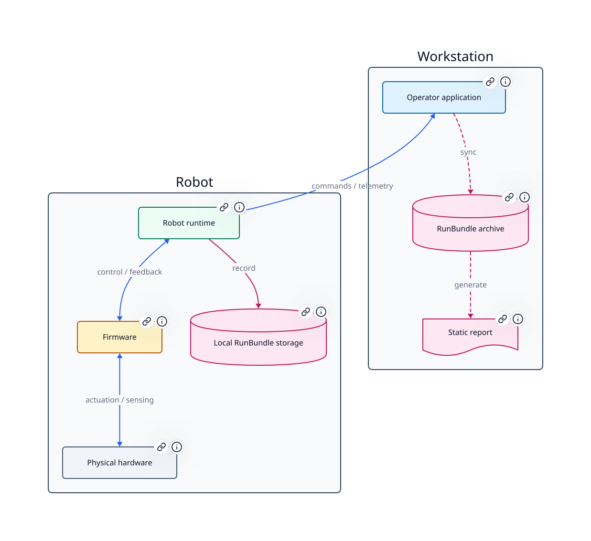

# Omniseer

[](https://github.com/jburo1/omniseer/actions/workflows/ci.yml)
[](https://jburo1.github.io/omniseer/)

Omniseer is an embodied AI system for running open-vocabulary perception and
bounded visual target acquisition and framing on a ROCK 5B+ mobile robot. The repository
contains the robot runtime, firmware integration, ROS 2 contracts, operator tools,
diagnostic gateway, preview transport, experiment recorder, and local report
workflow used to evaluate real robot runs.

The implemented loop connects robot execution to reviewable evidence:

```text
camera -> V4L2/RGA/RKNN YOLO-World -> ROS detections + telemetry
                                    -> bounded target acquisition + framing
                                    -> RunBundle evidence
                                    -> laptop inspection and static report
```

## Current Capabilities

- Hardware-accelerated V4L2 -> RGA -> RKNN producer/consumer vision runtime.
- YOLO-World text-embedding preparation and bounded detection post-processing.
- Typed `/yolo/detections` and `/vision/perf` ROS 2 contracts.
- JSONL stage telemetry, rolling performance summaries, and offline analysis tools.
- Bounded visual target acquisition and framing through `/cmd_vel_autonomy` and
  `twist_mux`.
- Local RunBundles with detections, performance summaries, system
  telemetry, native pipeline telemetry, evidence frames, inspection, retrieval,
  annotation, and static HTML reports.
- ROS 2 simulation and real-hardware bringup with firmware and micro-ROS integration.
- gRPC system status and preview control with on-demand SRT video export.
- GitHub Actions workflows covering portable software, Gazebo smoke, portable
  vision, portable runtime, firmware, and docs.

## Documentation

<p align="center">
  <a href="https://jburo1.github.io/omniseer/" aria-label="Open the Omniseer documentation">
    
  </a>
</p>

- [Project documentation](https://jburo1.github.io/omniseer/)
- [System architecture](docs/architecture/overview.md)
- [Verification evidence](docs/verification/evidence.md)
- [Edge-to-cloud perception](docs/perception/edge-to-cloud.md)
- [CI/CD overview](docs/verification/ci-cd.md)

## Current Boundary

GitHub CI validates portable software, asserted simulation contracts, firmware
compilation, portable runtime packaging, and documentation. Documented local
RunBundle evidence records target-hardware camera, RGA, RKNN/NPU, telemetry, and
recording behavior; raw local bundles are not currently included in the public
checkout. The evidence documentation separates CI coverage, local checks, and
target-hardware run records so implementation claims stay tied to their artifacts.
