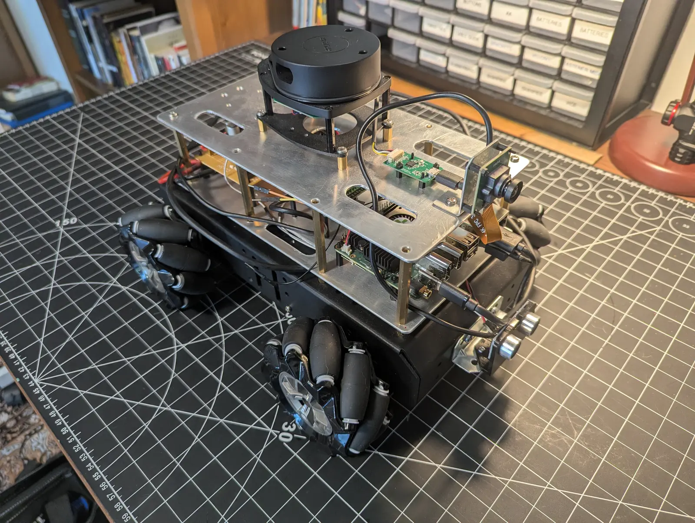
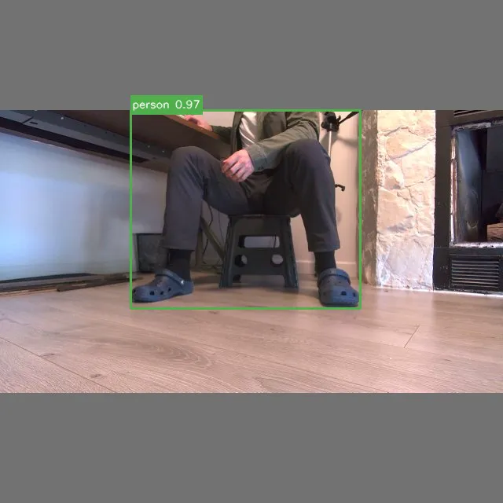
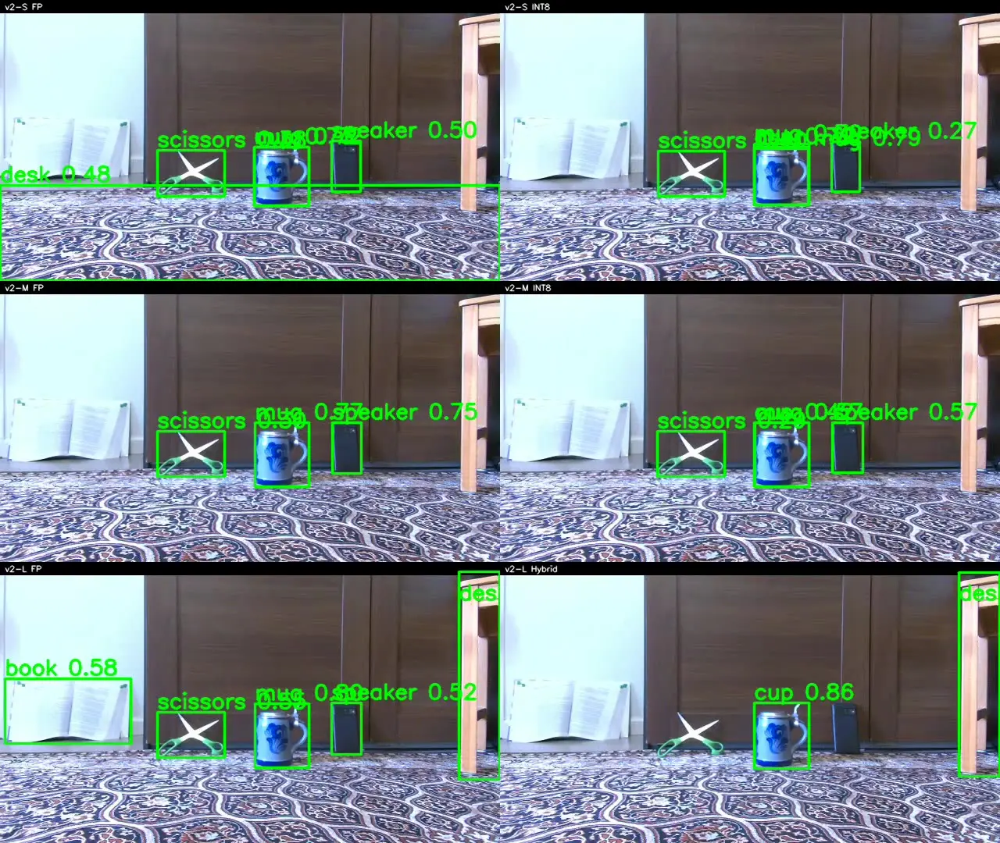
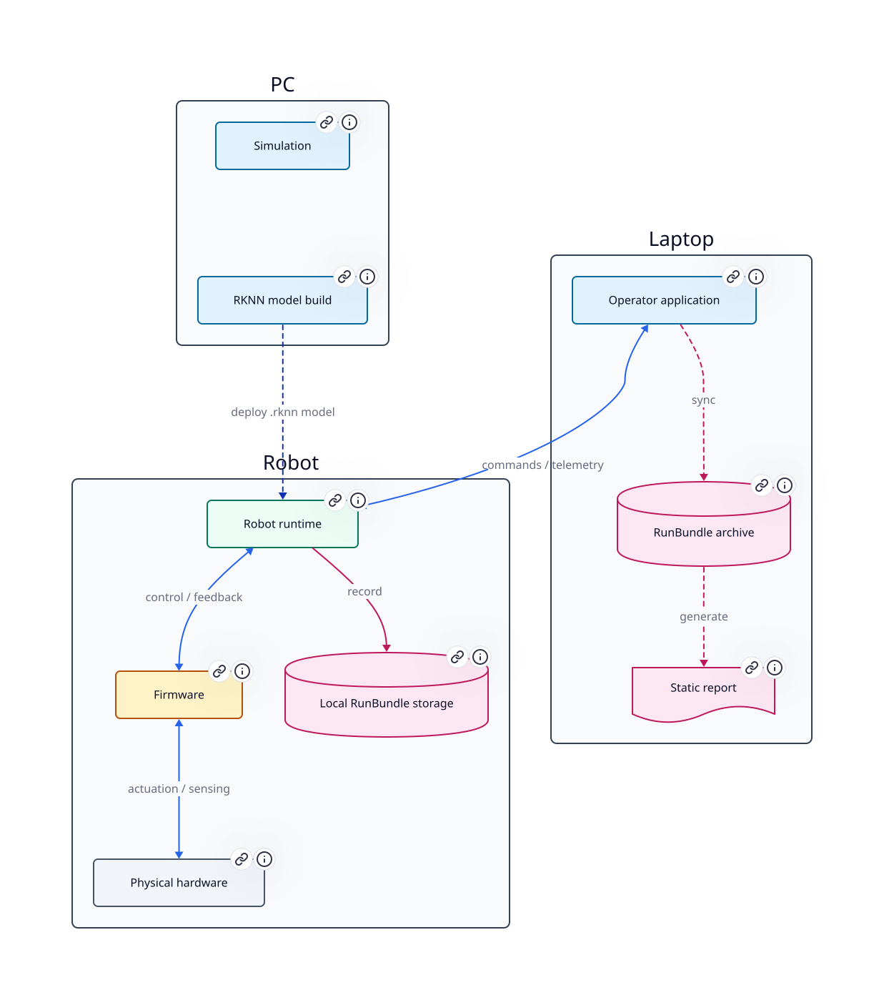

# Omniseer

<b>Physical edge AI for open-vocabulary perception and bounded visual autonomy on RK3588.</b>

Omniseer is a holonomic 4WD robot for developing and evaluating neural perception under hardware constraints. A native C++ V4L2 → RGA → RKNN pipeline runs open-vocabulary YOLO-World on a ROCK 5B+ NPU, feeds detections into bounded visual autonomy, and records physical runs with model provenance, latency, telemetry, detections, video, and control traces.

An operator application on a remote machine parameterizes, launches, and synchronizes experiments between the onboard SBC and laptop. The project spans model conversion and quantization, hardware-accelerated inference, ROS 2 and Gazebo integration, physical target acquisition, profiling, controlled experiments, and failure analysis.

[Documentation](https://jburo1.github.io/omniseer/) · [Architecture](https://jburo1.github.io/omniseer/architecture/overview/) · [v2-L FP Target Acquisition](https://jburo1.github.io/omniseer/verification/target-acquisition/) · [Six-Model Detector Comparison](https://jburo1.github.io/omniseer/verification/detector-comparison/) · [v2-L INT8 Quantization Failure Analysis](https://jburo1.github.io/omniseer/verification/int8-quantization-failure/)

  

<table align="center">
  <tr>
    <td></td>
    <td></td>
    <td></td>
  </tr>
</table>

## What the Robot Does

An operator specifies an open-vocabulary target such as `person` or `backpack`. The robot scans, acquires a stable neural detection, centers it, adjusts distance to reach the requested framing, stops at a configured proximity limit, and preserves the run as reproducible evidence.

https://github.com/user-attachments/assets/9afa632c-9b78-4978-9c06-8714d285d1c0

## Experiments

<table>
  <tr>
    <td width="33%" align="center" valign="top">
       
      <a href="https://jburo1.github.io/omniseer/verification/target-acquisition/">v2-L FP Target Acquisition</a> 
      Report generated from a successful run's data.
    </td>
    <td width="33%" align="center" valign="top">
       
      <a href="https://jburo1.github.io/omniseer/verification/detector-comparison/">Six-Model Detector Comparison</a> 
      A fixed-scene replay compares six YOLO-World RKNN configurations with the same vocabulary and post-processing; separate physical runs show their deployment throughput trade-offs.
    </td>
    <td width="33%" align="center" valign="top">
       
      <a href="https://jburo1.github.io/omniseer/verification/int8-quantization-failure/">v2-L INT8 Quantization Failure Analysis</a> 
      An RK3588 failure investigation asks whether v2-L INT8 preserves FP detection behavior, documenting its collapse and TD01 mixed precision's partial diagnostic recovery.
    </td>
  </tr>
</table>

## System at a Glance

RKNN model construction happens offline on the development PC; the deployed model runs entirely onboard. The mission-critical path stays on the robot: native C++ owns capture, preprocessing, inference, post-processing, and telemetry; ROS 2 carries typed detection, performance, command, odometry, sensor, and battery contracts; Teensy firmware and micro-ROS own low-level I/O. The operator gateway, preview stream, reports, and offboard inspection are diagnostic or review tooling, not dependencies of mission-critical perception or control. The robot runtime is packaged and verified as a containerized target runtime.

## Representative Engineering Evidence

| Evidence | What it supports | Public boundary |
| --- | --- | --- |
| GitHub Actions CI | Portable ROS package checks, Gazebo smoke topics, portable vision tests, firmware compilation, docs build, and hardware-independent runtime packaging | Does not prove camera, RKNN/RGA, LiDAR, Teensy, or physical-robot execution |
| The three flagship experiments above | Named physical-run, controlled replay, and target-hardware quantization claims | Their experiment-specific limitations apply; none is mAP, a replicated benchmark, or a general autonomy result |
| RunBundle tooling and target-runtime source | Reproducible manifests, telemetry, evidence frames, static reports, and the implemented V4L2/RGA/RKNN-to-ROS path | Tooling and source alone do not prove a particular target-hardware run |

## Engineering Contributions

- Native RK3588 perception and inference pipeline: V4L2 capture, RGA preprocessing, RKNN execution, post-processing, and detailed telemetry on the robot SBC.
- Bounded perception-to-control autonomy for target acquisition and framing, with command arbitration and a proximity stop.
- Reproducible RunBundle and evidence workflow that preserves configuration, telemetry, detections, media, annotations, and static reports for offboard review.
- Explicit simulation, real-hardware, and runtime-verification boundaries that keep portable checks distinct from target-hardware evidence.

## Repository Inspection Path

- [System Architecture](https://jburo1.github.io/omniseer/architecture/overview/) — robot, operator, firmware, runtime, and evidence boundaries.
- [Verification Evidence](https://jburo1.github.io/omniseer/verification/evidence/) — CI scope, target-hardware artifacts, and reproducibility limits.
- [Edge AI / On-Robot Runtime](https://jburo1.github.io/omniseer/perception/edge-to-cloud/) and [Vision Pipeline](https://jburo1.github.io/omniseer/perception/vision-pipeline/) — native perception and review path.
- [Operator Run Workflow](https://jburo1.github.io/omniseer/operations/operator-run-workflow/) — run, stop, retrieve, inspect, and report flow.
- [CI/CD Overview](https://jburo1.github.io/omniseer/verification/ci-cd/) and [Scripts Front Door](https://jburo1.github.io/omniseer/operations/scripts-frontdoor/) — supported checks and automation limits.
