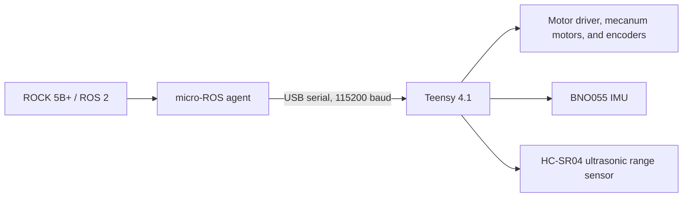

# Firmware & Robot I/O

## Purpose

The Teensy 4.1 runs the low-level firmware that turns normalized motion commands
into mecanum wheel targets and reads the robot-connected motor encoders, IMU,
ultrasonic range sensor, and battery voltage. It owns the periodic hardware-I/O
work, wheel mapping, and the local response to stale commands.

The ROCK 5B+ runs ROS 2 bringup, command arbitration, odometry conversion,
perception, autonomy, and operator tooling. It does not directly drive motor or
sensor hardware. This boundary keeps hardware timing and failure handling close to
the devices while presenting ROS interfaces to the higher-level runtime. See
[ROS Packages and Sim/Real Boundary](../robot-runtime/ros-packages.md) for the
shared simulation and real-hardware contracts.

## System Boundary



## micro-ROS Interface

`real_io.launch.py` runs `micro_ros_agent` on the ROCK 5B+ after a Teensy-device
preflight. By default it opens the configured Teensy USB serial device at 115200
baud. The firmware configures the PlatformIO micro-ROS transport as serial and
uses the Teensy's `Serial` connection as its custom transport.

The Teensy creates the `omniseer_teensy` micro-ROS node in ROS domain 42. The
agent bridges its subscription and publishers into the ROS 2 graph: a stamped
motion command reaches the firmware executor, and firmware telemetry is
published back through the agent. Firmware time-syncs with the agent during
initialization and periodically resynchronizes timestamps.

If initialization cannot ping the agent, the firmware retries once per second
and blinks the built-in LED. After connection, a dropped serial DTR signal, a
failed agent ping, or an executor error tears down the micro-ROS entities, sets
the motion command to zero, and returns to the retry loop. This is a local
communication-loss response; it is not a substitute for physical safety
validation.

## Firmware Responsibilities

- Convert `TwistStamped` planar velocity commands into mecanum wheel speeds and
  send bounded speed values to the I2C motor driver.
- Read and publish four motor-driver encoder counts and battery voltage.
- Acquire BNO055 orientation, angular velocity, and linear acceleration.
- Trigger, acquire, and publish HC-SR04 ultrasonic range measurements.
- Run motor output at 100 Hz, the micro-ROS executor at 200 Hz, encoder and IMU
  telemetry at 50 Hz, sonar work at 20 Hz, and battery telemetry at 1 Hz.

## ROS Interface

| Topic | Direction | Purpose |
| --- | --- | --- |
| `/mecanum_drive_controller/reference` (`geometry_msgs/msg/TwistStamped`) | ROS 2 → Teensy | Motion command. The firmware uses `linear.x`, `linear.y`, and `angular.z` for mecanum control. |
| `/encoder_counts` (`omniseer_msgs/msg/WheelEncoderCounts`) | Teensy → ROS 2 | Timestamped front-left, front-right, rear-left, and rear-right encoder counts; the ROS adapter derives wheel odometry. |
| `/imu` (`sensor_msgs/msg/Imu`) | Teensy → ROS 2 | BNO055 orientation, angular velocity, and linear acceleration, with frame ID `imu_link`. |
| `/range` (`sensor_msgs/msg/Range`) | Teensy → ROS 2 | HC-SR04 ultrasonic range, with frame ID `sonar_link`. |
| `/battery` (`sensor_msgs/msg/BatteryState`) | Teensy → ROS 2 | Motor-driver voltage reading, marked present and LiPo; percentage is unspecified. |
| `/micro_ros/debug` (`std_msgs/msg/String`) | Teensy → ROS 2 | Firmware micro-ROS diagnostic messages when the publisher is available. |

`/encoder_counts` is a real-only input to the ROS odometry adapter, rather than
the common odometry interface. The resulting `/mecanum_drive_controller/odometry`
contract is documented on the [ROS boundary page](../robot-runtime/ros-packages.md).

## Firmware Structure

- `src/main.cpp` starts peripherals and micro-ROS, registers the cooperative
  scheduler, and resets the MCU if the main loop stops being serviced for more
  than five seconds.
- `src/omniseer_tasks.cpp` wires scheduled motor, executor, encoder, IMU, sonar,
  and battery work to the hardware and micro-ROS objects.
- `src/micro_ros_node.cpp` owns serial transport, node setup, command reception,
  telemetry publication, timestamp synchronization, and reconnect cleanup.
- `src/hw_motor_driver.cpp` owns the I2C motor-driver protocol, wheel-channel
  mapping, encoder reads, battery reads, and speed limits.
- `lib/omniseer_core/` contains mecanum kinematics, command-timeout handling,
  BNO055 acquisition, and HC-SR04 acquisition.

## Build & Flash

Build the default `teensy41` PlatformIO environment from the repository root:

```bash
scripts/omni build firmware
```

To build and upload to a connected Teensy using the repository's headless helper:

```bash
scripts/omni flash teensy
```

The wrapper resolves PlatformIO dependencies, applies the repository's
micro-ROS PlatformIO compatibility patch, and uploads with the configured
`teensy-cli` protocol. The flash helper can fall back to `teensy_loader_cli`
when the PlatformIO upload fails and the built HEX file is available.

## Failure and Safety Behavior

The motion controller substitutes a zero velocity command when no command has
arrived for one second; the 100 Hz motor task then writes the resulting zero
wheel targets. Firmware initialization stops the wheels after the motor driver
is detected and configured. If that I2C device is not detected, initialization
does not continue and the built-in LED signals the fault.

On the implemented micro-ROS disconnect paths, firmware zeroes the commanded
motion before reconnecting. The watchdog resets an MCU whose main loop has not
been serviced for more than five seconds. Sensor read or publication failures
are handled by their individual paths: an encoder-read failure is logged and not
published, an invalid sonar reading is not published, and a failed battery read
is reported as a zero-volt value. This page does not infer additional hardware
interlocks from those behaviors.

## Verification Boundary

`scripts/omni build firmware` is the local compile check, and the CI firmware
workflow runs the same compile-only Teensy 4.1 build. The repository has a
PlatformIO test directory but no implemented firmware tests there. Compilation
does not verify flashing, motor direction, encoder correctness, IMU or sonar
behavior, battery readings, USB serial micro-ROS communication, or observed
stale-command and disconnect stopping behavior. Those require the target
Teensy, motor hardware, sensors, ROCK 5B+, and an observed hardware run.

For the full software evidence boundary, see [CI/CD Overview](../verification/ci-cd.md)
and [Verification Evidence](../verification/evidence.md).
