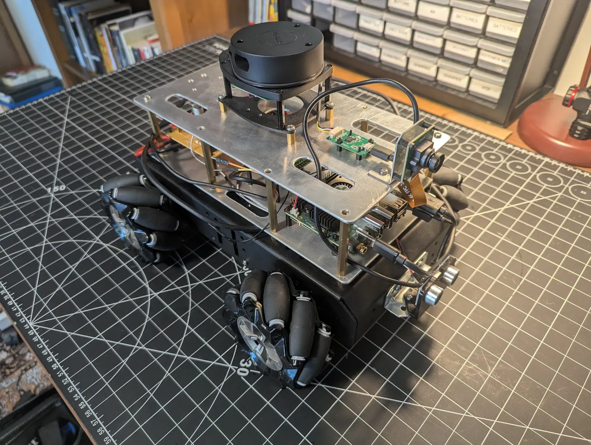
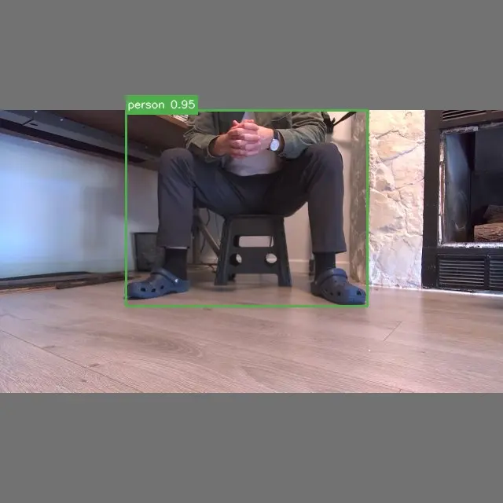
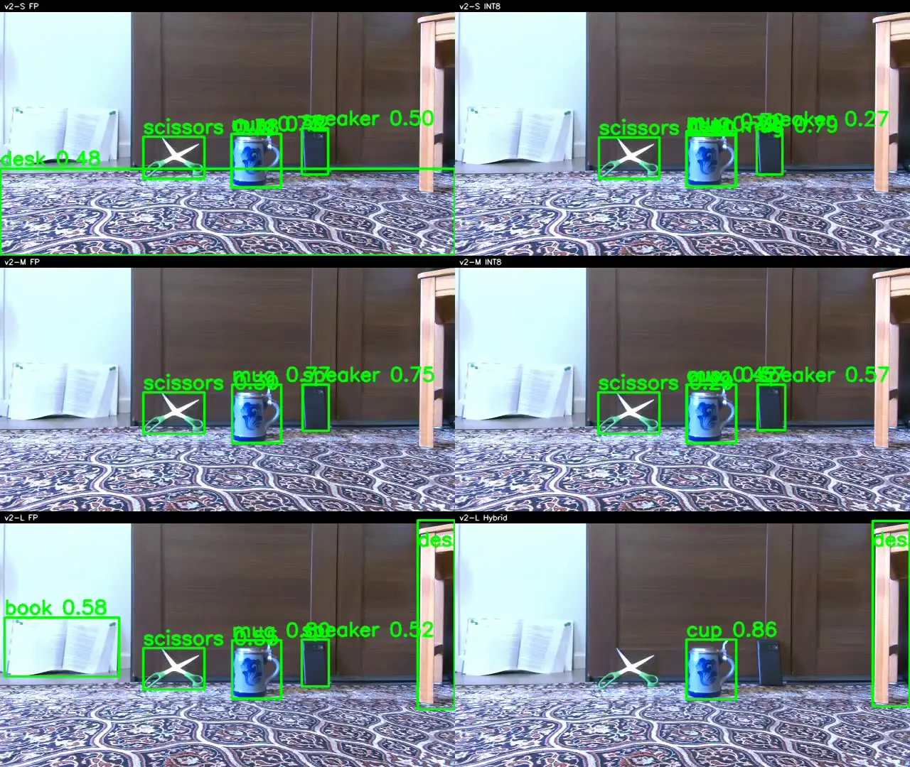

# Omniseer

**Physical edge-AI robotics for open-vocabulary perception, bounded behavior, and reproducible evidence.** Omniseer runs a native V4L2/RGA/RKNN perception path on a ROCK 5B+ (RK3588), connects detections to deliberately bounded target acquisition and framing, and preserves the artifacts needed to review what occurred on the robot. ROS 2 carries the runtime contracts; the engineering focus is the edge-to-physical-system boundary.

The implemented behavior is intentionally narrow: scan for a configured class, acquire a stable detection, center it, make bounded framing adjustments, and stop at a configured proximity limit. It is not navigation-based object search, room-scale exploration, or a claim of general autonomy.

<p align="center">
  
</p>

## Evidence-backed studies

<div class="grid cards" markdown>

-   :material-robot-industrial-outline: **Target acquisition on the physical robot**

    ---

    

    A public v2-M INT8 RunBundle records first detection at **24.5 s**, terminal `framed` success at **51.1 s**, **10.04 FPS** mean consumer throughput, **96.22 ms** RKNN inference p50, and **zero target-loss episodes**.

    [:octicons-arrow-right-24: Review the run](verification/target-acquisition.md)

-   :material-chart-timeline-variant-shimmer: **Six-detector deployment trade-off**

    ---

    

    In one controlled scene, v2-M FP led coverage at **41.7%**. Across six independent physical case studies, v2-S INT8 reached the highest observed throughput at **16.54 FPS**; v2-M INT8 was the strongest observed coverage/throughput compromise for this scene.

    [:octicons-arrow-right-24: Compare detectors](verification/detector-comparison.md)

-   :material-alert-decagram-outline: **INT8 failure localized, not hidden**

    ---

    Recalibrated v2-L INT8 retained **0 of 1,301** FP detections in the final 300-frame RK3588 evaluation. TD01 mixed precision recovered **60.6%**, locating the failure in the classification/projection path without presenting the hybrid as production-ready.

    [:octicons-arrow-right-24: Read the failure analysis](verification/int8-quantization-failure.md)

</div>

## System at a glance

```text
Camera -> V4L2 / RGA / RKNN inference -> normalized detections -> bounded acquisition + framing
                                        |                              |
                                        +-> performance telemetry       +-> terminal evidence
                                                                         |
                                                            RunBundle -> offboard review
```

The mission-critical path stays on the robot: camera capture, preprocessing, RKNN inference, post-processing, command arbitration, robot I/O, and bounded behavior. Operator dashboards, preview streaming, reports, and analysis remain optional diagnostic or review tooling.

[Explore the system architecture](architecture/overview.md){ .md-button .md-button--primary }
[Browse the engineering documentation](perception/edge-to-cloud.md){ .md-button }

## Results with evidence boundaries

The three studies above are deliberately different kinds of evidence: one complete public physical RunBundle, one fixed-source controlled replay plus six independent physical-run summaries, and one frozen-frame quantization investigation. They support their named claims—not general detector accuracy, replicated benchmarks, or broad autonomy assertions.

For the artifact inventory, public-versus-local distinction, CI scope, and reproducibility limits, see [Verification Evidence](verification/evidence.md). The source studies retain the detailed methodology, provenance, and limitations.
