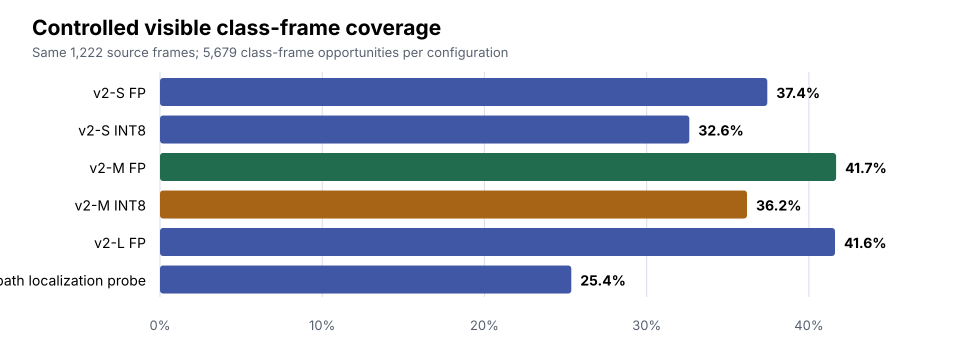
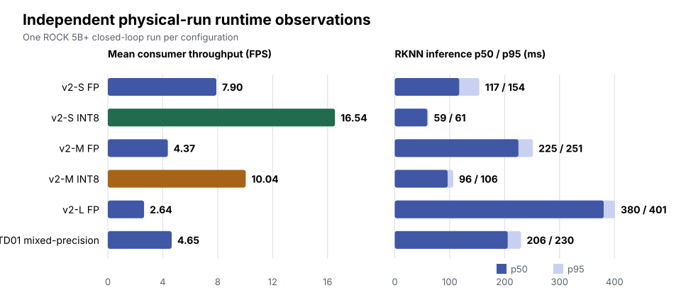
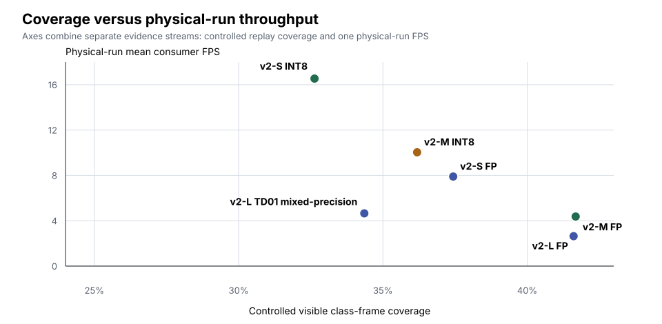
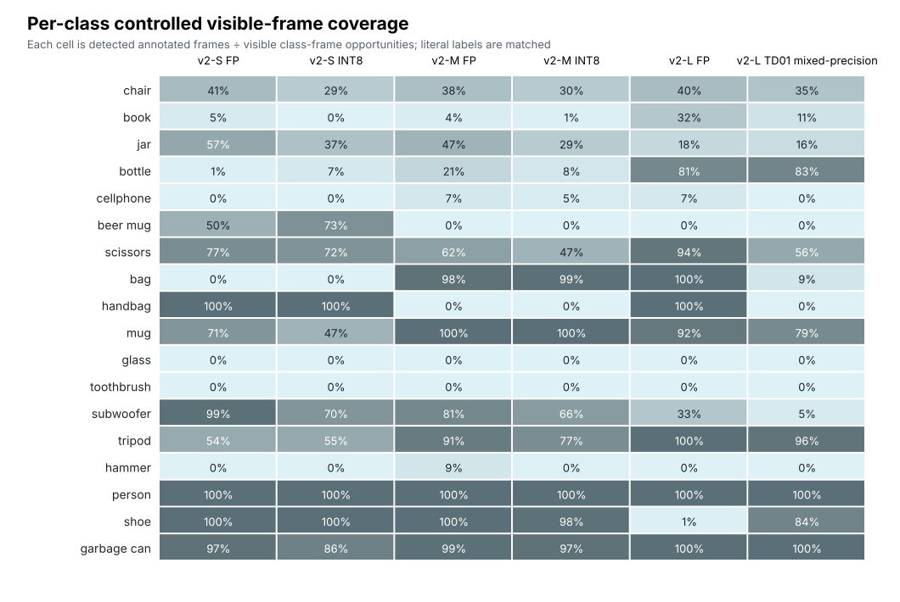

# Six-Model Detector Comparison

## Experimental design

| Evidence source | Design | What it supports |
| --- | --- | --- |
| **Controlled replay** | Each configuration consumes the same 1,222 source frames. Vocabulary, score threshold (0.25), NMS IoU threshold (0.45), and post-processing are fixed. | A controlled, frame-aligned presence/visibility comparison in this scene. |
| **Physical trials** | One independent closed-loop robot run per recorded configuration label. | Runtime and system observations from six case studies. |

The controlled-replay v2-L diagnostic configuration is the **v2-L
classifier-path localization probe**,
`yolo_world_v2_l_hybrid_td01_clspreds0_mm_inputs_fp16.rknn`
(`df72d337ad03a7b90c5a96f2b44495fd25f5747094019b038b2823d5133d398e`). It
is distinct from the quantization investigation's v2-L TD01 mixed-precision
mitigation (`yolo_world_v2_l_hybrid_td01.rknn`,
`20e43523ab4221fd755553030dbc58943f457839d5583b1f2f29954489c2ef92`). The
retained physical-run summary does not prove the exact RKNN artifact or hash
for `v2l_hybrid_scene_1`; its v2-L hybrid label is therefore not treated as
either controlled-replay artifact.

The controlled metric is **visible class-frame coverage**. A *class-frame
opportunity* is one frame in which a manually annotated class is visible. The
19 inclusive class-interval sets sum to **5,679 class-frame opportunities**. Multiple classes can be visible in one source frame, so
the same 1,222 unique source frames legitimately create 5,679 opportunities.

## Key findings

- **v2-M FP** has the highest controlled coverage: **2,367 / 5,679 class-frame opportunities (41.7%)**.
- **v2-S INT8** has the highest observed physical-run throughput: **16.54 FPS**.
- **v2-M INT8** is the observed middle-ground configuration: **36.2%** controlled coverage and **10.04 FPS** in its independent physical run.
- **All six physical trials completed with zero target-loss episodes.**

## Visual comparison

### Controlled replay

<video controls preload="metadata" poster="../assets/evidence/detector-comparison-poster.webp" width="100%">
  <source src="https://media.githubusercontent.com/media/jburo1/omniseer/master/studies/detector_comparison/scan_final_recal/evidence/controlled_replay_2x3.mp4" type="video/mp4" />
  Your browser cannot play this video. <a href="https://github.com/jburo1/omniseer/blob/master/studies/detector_comparison/scan_final_recal/evidence/controlled_replay_2x3.mp4">Open the controlled replay video</a>.
</video>

*Controlled replay video: a frame-aligned view of the same source sequence for every configuration. It provides qualitative context for the controlled coverage metrics.*



| Configuration | Detected / class-frame opportunities | Coverage |
| --- | ---: | ---: |
| v2-S FP | 2,126 / 5,679 | 37.4% |
| v2-S INT8 | 1,853 / 5,679 | 32.6% |
| v2-M FP | 2,367 / 5,679 | 41.7% |
| v2-M INT8 | 2,055 / 5,679 | 36.2% |
| v2-L FP | 2,363 / 5,679 | 41.6% |
| v2-L classifier-path localization probe | 1,440 / 5,679 | 25.4% |

Every configuration detected `person` on all 293 annotated visible frames.

### Independent physical trials

<video controls preload="metadata" poster="../assets/evidence/detector-comparison-physical-poster.webp" width="100%">
  <source src="https://media.githubusercontent.com/media/jburo1/omniseer/master/studies/detector_comparison/scan_final_recal/evidence/physical_trials_grid_2x3.mp4" type="video/mp4" />
  Your browser cannot play this video. <a href="https://github.com/jburo1/omniseer/blob/master/studies/detector_comparison/scan_final_recal/evidence/physical_trials_grid_2x3.mp4">Open the physical-trials grid video</a>.
</video>

*Physical-trials grid: one independent closed-loop run per configuration.*

All six physical trials completed successfully with zero target-loss episodes.

| Configuration | Mean consumer FPS | Inference p50 / p95 | Source-age p95 | Memory-used p95 |
| --- | ---: | ---: | ---: | ---: |
| v2-S FP | 7.90 | 117.28 / 153.95 ms | 181.50 ms | 2955.47 MB |
| v2-S INT8 | 16.54 | 59.19 / 60.76 ms | 95.48 ms | 2959.68 MB |
| v2-M FP | 4.37 | 225.12 / 251.43 ms | 282.81 ms | 3349.19 MB |
| v2-M INT8 | 10.04 | 96.22 / 106.47 ms | 139.42 ms | 2999.90 MB |
| v2-L FP | 2.64 | 380.25 / 400.98 ms | 438.76 ms | 3306.73 MB |
| v2-L hybrid (artifact identity unproven) | 4.65 | 205.55 / 229.90 ms | 262.32 ms | 4157.62 MB |



### Combined view, with evidence boundary preserved



The scatter plot is a deployment-trade-off view, its x-axis comes from
controlled replay while its y-axis comes from one independent physical run per
recorded configuration label. In particular, its v2-L point must not be read
as a model-paired comparison: the controlled probe and the physical-run
artifact have different/unknown identities.



The heatmap makes the class-level variation visible.

## Engineering interpretation

v2-M FP narrowly leads v2-L FP in this controlled scene (41.7% versus 41.6%).
For the separate physical case studies, v2-S INT8 has the highest observed
throughput, while v2-M INT8 provides the strongest observed coverage/throughput
middle ground. Relative to their FP counterparts, v2-S INT8 improves inference
p50/p95 by 1.98×/2.53× and throughput by 2.09×; v2-M INT8 by 2.34×/2.36× and
2.30×. The v2-L classifier-path localization probe has lower controlled
coverage than v2-L FP. The separately labeled v2-L hybrid physical run is
faster than v2-L FP and has the highest observed memory use, but its exact
artifact is unproven, so it cannot be attributed to the probe or to v2-L TD01
mixed-precision.

Success times span 50.5–57.8 s, much less than the 59.19–380.25 ms inference
p50 range. That is consistent with scan/control timing also mattering in this
bounded trial.

## Reproducibility and data quality

The charts are generated by
[`render_docs_assets.py`](https://github.com/jburo1/omniseer/blob/master/studies/detector_comparison/scan_final_recal/evidence/render_docs_assets.py)
from tracked replay JSONLs, [replay provenance](https://github.com/jburo1/omniseer/blob/master/studies/detector_comparison/scan_final_recal/evidence/replay_provenance.json),
[visibility annotations](https://github.com/jburo1/omniseer/blob/master/studies/detector_comparison/scan_final_recal/visibility.txt),
and the tracked [physical-run summary table](https://github.com/jburo1/omniseer/blob/master/studies/detector_comparison/scan_final_recal/results.md).
It also creates the physical-run video poster directly from the tracked grid
video. Regenerate them with:

```bash
python3 studies/detector_comparison/scan_final_recal/evidence/render_docs_assets.py
```

The retained [comparison report](https://github.com/jburo1/omniseer/blob/master/studies/detector_comparison/scan_final_recal/evidence/comparison_report.html),
[replay JSONLs](https://github.com/jburo1/omniseer/tree/master/studies/detector_comparison/scan_final_recal/evidence/replay_jsonl),
[physical-run summary](https://github.com/jburo1/omniseer/blob/master/studies/detector_comparison/scan_final_recal/physical_runs.yaml),
and checksums remain available for detailed provenance. Rerendering the replay
video also requires the retained source stream. Apart from the public v2-L FP
RunBundle, physical timing values are summaries checked against retained local
bundles and are not independently recomputable from a public clone.

## Limitations

This is one-scene presence/visibility evidence, not mAP, bounding-box recall,
or general detector accuracy. Controlled replay is not latency benchmarking.
The physical trials are unreplicated case studies and
cannot establish statistical significance or causal performance differences.
Physical-run detections must not be treated as controlled accuracy comparisons.
