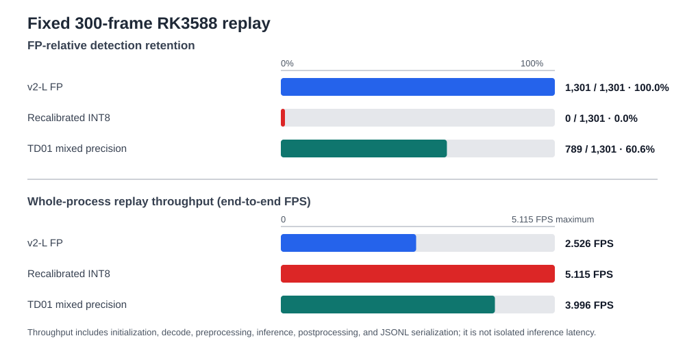
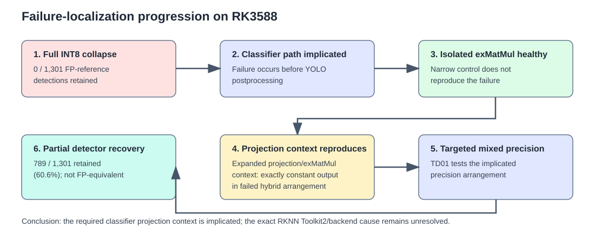

# v2-L INT8 Quantization Failure Analysis

## Question and design

Does recalibrated v2-L INT8 retain v2-L FP-reference detections on RK3588,
and can targeted mixed precision localize the observed failure?

### Qualitative contrast

When run through the full 1,222-frame source sequence, the quantized v2-L model's performance collapses completely, as shown in the left pane in the video below. The right pane shows v2-L TD01 mixed-precision on that same sequence. This video is qualitative context; the quantitative evaluation below uses a deterministic 300-frame subset of the same source sequence.

<video controls preload="metadata" width="100%">
  <source src="https://media.githubusercontent.com/media/jburo1/omniseer/master/studies/quantization/yolo_world_v2l_int8/evidence/scan_final_v2l_int8_vs_hybrid.mp4" type="video/mp4" />
  Your browser cannot play this video. <a href="https://github.com/jburo1/omniseer/blob/master/studies/quantization/yolo_world_v2l_int8/evidence/scan_final_v2l_int8_vs_hybrid.mp4">Open the INT8-versus-TD01 replay media</a>.
</video>

### Quantitative evaluation

The canonical quantitative evaluation replays a deterministic 300-frame subset of the same 1,222-frame source sequence through the
existing `vision_replay` detector path on RK3588, with score
threshold 0.25, and NMS IoU threshold 0.45. We ran the same frames through v2-L FP, v2-L recalibrated INT8, and v2-L TD01 mixed-precision.

## Results

On the fixed 300-frame RK3588 replay, recalibrated and quantized v2-L INT8 retained
**0 of 1,301 v2-L FP-reference detections**. The diagnostic mitigation, **v2-L TD01 mixed-precision**, produced
**1,030 total detections**, of which **789** matched v2-L FP-reference detections:
**789 / 1,301 (60.6%)** retention. The failure localizes to the classifier projection context on RK3588, but the exact RKNN Toolkit2/backend cause remains unresolved, and the RKNN compiler is proprietary.

### Detector-level results

| Model | Active frames | Detections | FP-reference detections retained | Whole-process replay throughput |
| --- | ---: | ---: | ---: | ---: |
| v2-L FP | 300 | 1,301 | baseline (1,301 / 1,301) | 2.526 FPS |
| v2-L recalibrated INT8 | 0 | 0 | **0 / 1,301 (0.0%)** | 5.115 FPS |
| v2-L TD01 mixed-precision | 295 | 1,030 | **789 / 1,301 (60.6%)** | 3.996 FPS |

The higher INT8 replay throughput does not offset its detector collapse.

### Class-specific recovery

v2-L TD01 mixed-precision recovered some classes strongly while leaving others severely degraded.
These are FP-relative agreement measures, not ground-truth precision or recall.

| Strongest TD01 retention | Retained | Weakest TD01 retention | Retained |
| --- | ---: | --- | ---: |
| person | 81 / 86 (94.2%) | cellphone | 0 / 5 (0.0%) |
| potted plant | 119 / 127 (93.7%) | handbag | 2 / 48 (4.2%) |
| tripod | 58 / 63 (92.1%) | bag | 4 / 59 (6.8%) |
| cup | 47 / 52 (90.4%) | book | 18 / 73 (24.7%) |
| garbage can | 120 / 137 (87.6%) | subwoofer | 7 / 27 (25.9%) |
| bottle | 66 / 79 (83.5%) | desk | 37 / 124 (29.8%) |

### Failure localization

Full INT8 collapsed before YOLO postprocessing, implicating the classification
path. The isolated exMatMul micrograph remained healthy. In contrast, the
expanded lowered projection/exMatMul context reproduced the failed hybrid
arrangement on RK3588 with exactly constant output; FP16 and healthy-hybrid
controls remained non-constant. This localizes the failure to the required
classifier projection context rather than an isolated matrix multiply. It does
not identify the exact proprietary Toolkit2/backend mechanism.

Conceptually, v2-L TD01 mixed-precision is a targeted hybrid precision layout: it retains FP16 at
the 80x80 classifier projection and text operand around the MatMul boundary,
in addition to the validated FP16 classifier outputs, while the rest remains
quantized. It was used to test the implicated precision arrangement, not to
recreate FP behavior. The [technical appendix](../perception/int8-quantization-investigation.md)
records the layer-level conversion details.

## Interpretation

### Engineering decision

v2-L recalibrated INT8 is unsuitable: it collapsed before post-processing
in the final replay. v2-L TD01 mixed-precision is diagnostic evidence of partial recovery and
localization, not an FP-equivalent or validated production replacement.
**v2-L FP remains the quality reference.**

## Evidence and reproducibility

This page is the canonical INT8 experiment narrative. The
[technical appendix](../perception/int8-quantization-investigation.md) records
the conversion contract, host-analysis procedure, hashes, and artifact
retention details that support it.

The compact retained evidence consists of the 300-frame summary and normalized
JSONLs, model and command provenance, frozen-frame manifest, RK3588
projection-context metrics, replay provenance, and evidence inventory. For raw-artifact inspection, see the repository's
[300-frame result bundle](https://github.com/jburo1/omniseer/tree/master/studies/quantization/yolo_world_v2l_int8/evidence/final_multiframe_rk3588/results),
[frame manifest](https://github.com/jburo1/omniseer/blob/master/studies/quantization/yolo_world_v2l_int8/evidence/final_multiframe_rk3588/manifest.json),
[projection-context metrics](https://github.com/jburo1/omniseer/blob/master/studies/quantization/yolo_world_v2l_int8/evidence/projection_context_rk3588/metrics.json),
and [evidence inventory](https://github.com/jburo1/omniseer/blob/master/studies/quantization/yolo_world_v2l_int8/evidence/EVIDENCE_INDEX.md).

## Limitations

FP is a behavioral reference, not ground truth. FP-relative matching is
class-aware, IoU >= 0.50, and deterministic one-to-one matching. Reported FPS
is whole-process replay throughput, not isolated inference latency. This is a
fixed 300-frame RK3588 comparison with recorded models, thresholds, and replay
path; it is not broad deployment validation or proof of a proprietary
Toolkit2/backend root cause. Exact reruns require the non-retained source
transport stream and PNG inputs identified by the retained hashes and manifest.
