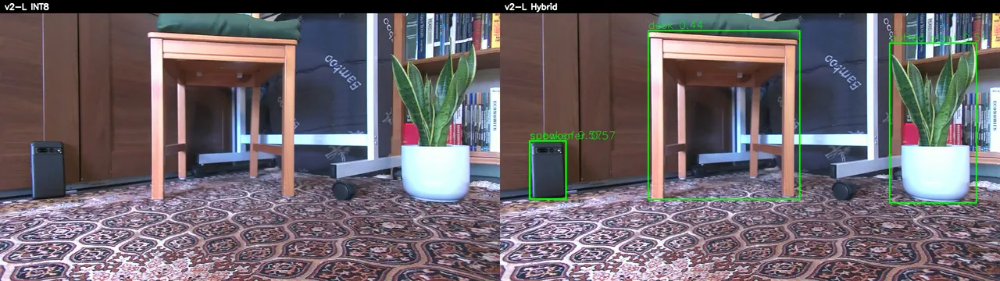

# v2-L INT8 Quantization Failure Analysis

## Engineering question

Could recalibrated YOLO-World v2-L INT8 preserve useful open-vocabulary
behavior on RK3588, and could a targeted mixed-precision layout identify a
practical recovery path?

## Method / experimental setup

The canonical evaluation replays 300 frozen representative frames through the
existing `vision_replay` detector path on RK3588, with no warmup, score
threshold 0.25, and NMS IoU threshold 0.45. FP is a behavioral reference, not
ground truth. FP-relative retention requires the same class and an IoU of at
least 0.50; all eligible pairs are sorted by descending IoU, then FP index,
then candidate index and accepted by deterministic greedy one-to-one matching.

The conversion contract targets RK3588 with `images=[1,3,640,640]` and
`texts=[1,80,512]`; images use `mean=[0,0,0]` and `std=[255,255,255]`, with
named `images` and `texts` inputs. RKNN Toolkit2 `2.1.0+708089d1` builds INT8
from the 100-frame calibration set and its generated fixed-shape CLIP text
input. The detailed tool, exporter, input, and artifact hashes are retained in
the [technical appendix](../perception/int8-quantization-investigation.md).

<video controls preload="metadata" width="100%">
  <source src="https://media.githubusercontent.com/media/jburo1/omniseer/master/studies/quantization/yolo_world_v2l_int8/evidence/scan_final_v2l_int8_vs_hybrid.mp4" type="video/mp4" />
  Your browser cannot play this video. <a href="https://github.com/jburo1/omniseer/blob/master/studies/quantization/yolo_world_v2l_int8/evidence/scan_final_v2l_int8_vs_hybrid.mp4">Open the INT8-versus-TD01 replay media</a>.
</video>

*The retained derived still is taken from the canonical replay above. It is a
presentation aid, not new experimental evidence or a ground-truth comparison.*

## Results

| Model | Active frames | Detections | Matched FP detections | FP detections retained | Whole-process replay |
| --- | ---: | ---: | ---: | ---: | ---: |
| v2-L FP | 300 | 1,301 | — | — | 118.751 s / 2.526 FPS |
| v2-L recalibrated INT8 | 0 | 0 | 0 / 1,301 | **0.0%** | 58.653 s / 5.115 FPS |
| v2-L TD01 mixed precision | 295 | 1,030 | 789 / 1,301 | **60.6%** | 75.084 s / 3.996 FPS |

TD01 retained substantial FP-relative behavior for person (81/86, 94.2%),
potted plant (119/127, 93.7%), tripod (58/63, 92.1%), cup (47/52, 90.4%),
garbage can (120/137, 87.6%), and bottle (66/79, 83.5%). Severe degradation
remained for handbag (2/48, 4.2%), bag (4/59, 6.8%), cellphone (0/5), book
(18/73, 24.7%), subwoofer (7/27, 25.9%), and desk (37/124, 29.8%). These are
FP-relative agreement measures, not ground-truth precision or recall.

The replay times include model/text initialization, PNG decode, CPU letterbox
preprocessing, RKNN inference, postprocessing, and JSONL serialization. They
are whole-process timing, not isolated RKNN inference latency.

The failure occurs in the classification path before YOLO postprocessing. A
narrow exMatMul micrograph remained healthy, but the expanded lowered
projection/exMatMul context reproduced the failed hybrid arrangement on
RK3588: its output was exactly constant. FP16 and healthy-hybrid controls
remained non-constant. This localizes the failure to the required projection
context and precision arrangement rather than an isolated matrix multiply;
the exact Toolkit2/backend mechanism remains unresolved.

## Engineering interpretation and decision

Recalibrated v2-L INT8 is unsuitable for this model and conversion contract:
it collapsed before post-processing in the final replay. TD01 is diagnostic
evidence of partial recovery and localization, not an FP-equivalent or
validated production replacement. v2-L FP remains the quality reference. The
root-cause investigation is closed unless a vendor bug report or a
production-quality v2-L mixed-precision deployment is specifically required.

## Evidence and reproducibility

This page is the canonical INT8 experiment narrative. The
[technical appendix](../perception/int8-quantization-investigation.md) records
the conversion contract, host-analysis procedure, hashes, and artifact
retention details that support it; it does not supersede this result or
decision.

The compact retained evidence consists of the 300-frame summary and normalized
JSONLs, model and command provenance, frozen-frame manifest, RK3588
projection-context metrics, replay provenance, and evidence inventory. The
source transport stream and extracted PNGs are intentionally non-retained
external inputs, identified by hashes and a deterministic extraction recipe.
For secondary raw-artifact inspection, see the repository's
[300-frame result bundle](https://github.com/jburo1/omniseer/tree/master/studies/quantization/yolo_world_v2l_int8/evidence/final_multiframe_rk3588/results),
[frame manifest](https://github.com/jburo1/omniseer/blob/master/studies/quantization/yolo_world_v2l_int8/evidence/final_multiframe_rk3588/manifest.json),
[projection-context metrics](https://github.com/jburo1/omniseer/blob/master/studies/quantization/yolo_world_v2l_int8/evidence/projection_context_rk3588/metrics.json),
and [evidence inventory](https://github.com/jburo1/omniseer/blob/master/studies/quantization/yolo_world_v2l_int8/evidence/EVIDENCE_INDEX.md).

## Limitations

This is a fixed 300-frame RK3588 comparison with recorded models, thresholds,
and replay path. It is not ground-truth precision or recall, broad deployment
validation, isolated latency measurement, or proof of a proprietary
Toolkit2/backend root cause. Independently rerunning the evaluation requires
access to the non-retained source artifacts.
