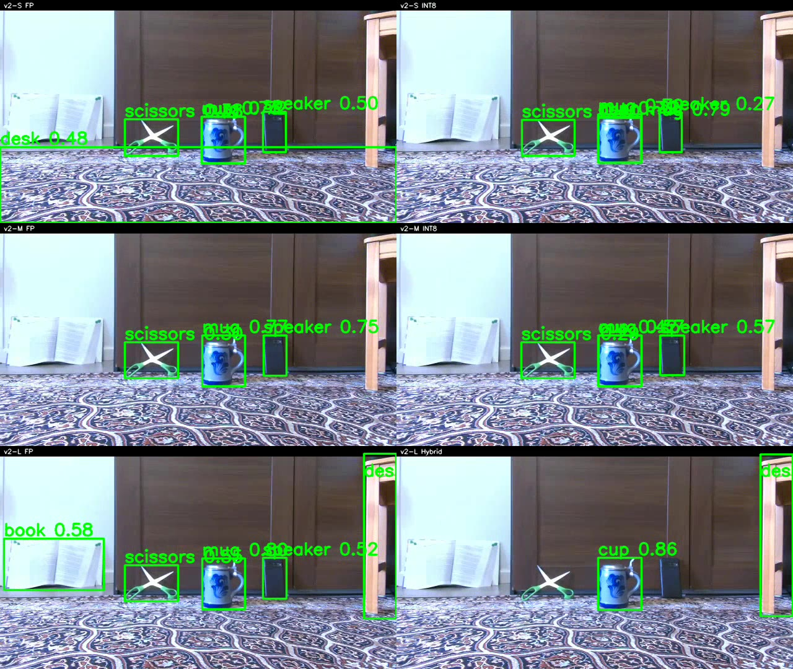

# Six-model YOLO-World comparison on a recalibrated 360° scene

## Engineering question and poster

**Engineering question:** with one repaired, frame-aligned 360° source scene, how do the six final YOLO-World RKNN detector configurations differ in presence/visibility behavior under the same vocabulary and post-processing?

The linked [controlled replay video](evidence/controlled_replay_2x3.mp4) processes exactly the same 1,222 repaired source frames through each detector. It is a 3-row × 2-column layout, pairing FP with INT8 or Hybrid by model size: v2-S, v2-M, then v2-L. The poster is a representative frame from that video; it shows no people or identifying information.

## Headline deployment trade-off

In the fixed-source replay, v2-M FP has the highest visible-frame coverage at 2,367 / 5,679 (41.7%), narrowly ahead of v2-L FP at 41.6%. In six independent physical runs, v2-S INT8 has the highest mean consumer throughput at 16.54 FPS. v2-M INT8 is the most plausible coverage/throughput compromise for this scene: 36.2% controlled coverage and 10.04 FPS in its independent run.

## Controlled replay results

The replay holds source, repair, class vocabulary, score threshold (0.25), NMS IoU threshold (0.45), and maximum detections (100) fixed. Only the detector configuration changes.

| Configuration | Visible-frame detections | Rate | Absent dog frames | Absent cat frames |
| --- | ---: | ---: | ---: | ---: |
| v2-S FP | 2,126 / 5,679 | 37.4% | 34 | 0 |
| v2-S INT8 | 1,853 / 5,679 | 32.6% | 6 | 0 |
| v2-M FP | 2,367 / 5,679 | 41.7% | 45 | 0 |
| v2-M INT8 | 2,055 / 5,679 | 36.2% | 23 | 0 |
| v2-L FP | 2,363 / 5,679 | 41.6% | 33 | 0 |
| v2-L Hybrid | 1,440 / 5,679 | 25.4% | 0 | 0 |

The preserved [replay provenance](evidence/replay_provenance.json), six [replay JSONLs](evidence/replay_jsonl/), [visibility annotations](visibility.txt), and [comparison report](evidence/comparison_report.html) make these metrics independently recomputable. Full controlled results and limits are in [results.md](results.md).

## Independent physical-run summary

The [physical-run presentation grid](evidence/physical_trials_grid_2x3.mp4) is a 2-row × 3-column display of six independent physical ROCK 5B+ runs. Each panel begins at its own run start and the grid ends at the shortest overlay; it is supporting end-to-end case-study evidence, not a frame-aligned comparison.

| Configuration | Outcome | First detection | Success | Mean consumer FPS | Inference p50 | Inference p95 |
| --- | --- | ---: | ---: | ---: | ---: | ---: |
| v2-S FP | success | 24.6 s | 53.4 s | 7.90 | 117.28 ms | 153.95 ms |
| v2-S INT8 | success | 24.6 s | 50.5 s | 16.54 | 59.19 ms | 60.76 ms |
| v2-M FP | success | 25.2 s | 53.9 s | 4.37 | 225.12 ms | 251.43 ms |
| v2-M INT8 | success | 24.5 s | 51.1 s | 10.04 | 96.22 ms | 106.47 ms |
| v2-L FP | success | 25.4 s | 56.1 s | 2.64 | 380.25 ms | 400.98 ms |
| v2-L Hybrid | success | 24.9 s | 57.8 s | 4.65 | 205.55 ms | 229.90 ms |

The public-safe [physical-run summary](physical_runs.yaml) binds each row to its local manifest hash and records the shared hardware, Git revision, container digest, and completion status.

## Joint engineering evaluation

FP-to-accelerated inference ratios were calculated from the independent-run measurements: v2-S INT8 reduces p50/p95 latency by 1.98×/2.53× and raises throughput 2.09× over v2-S FP; v2-M INT8 does so by 2.34×/2.36× and 2.30×; v2-L Hybrid does so by 1.85×/1.74× and 1.76× over v2-L FP.

v2-M FP is the highest-coverage configuration in the controlled replay, while v2-S INT8 is the highest-throughput physical configuration. v2-L FP provides high controlled coverage with the largest observed latency. v2-L Hybrid is faster than v2-L FP, but substantially weaker in controlled coverage and has the highest observed memory use. All six trials completed successfully with no target-loss episodes. Time to success varied much less than inference latency, which suggests that this bounded trial was also dominated by scan/control timing.

These are one independent physical run per configuration: end-to-end case-study measurements, not replicated benchmark estimates or proof of causal model differences. Do not use physical-run detections for controlled accuracy comparisons. Detection coverage comes from the fixed-source replay; runtime behavior comes from the independent trials.

## Evidence and reproducibility

The original replay provenance is unchanged. [checksums.sha256](checksums.sha256) contains only tracked paths that a public clone can verify; the withheld local source-stream hash is recorded separately in [withheld_source_hashes.sha256](withheld_source_hashes.sha256). The complete RunBundles and raw physical manifests remain ignored local evidence. No inference, report generation, or video rendering was rerun for this study consolidation.

## Limitations

This is one-scene presence/visibility evidence, not mAP, bounding-box recall, or general detector accuracy. Controlled replay is not latency benchmarking; the physical results are unreplicated and cannot establish statistical significance or causal performance differences. The retained physical thermal telemetry has no throttle value for any trial, so it cannot substantiate a no-throttling claim.
