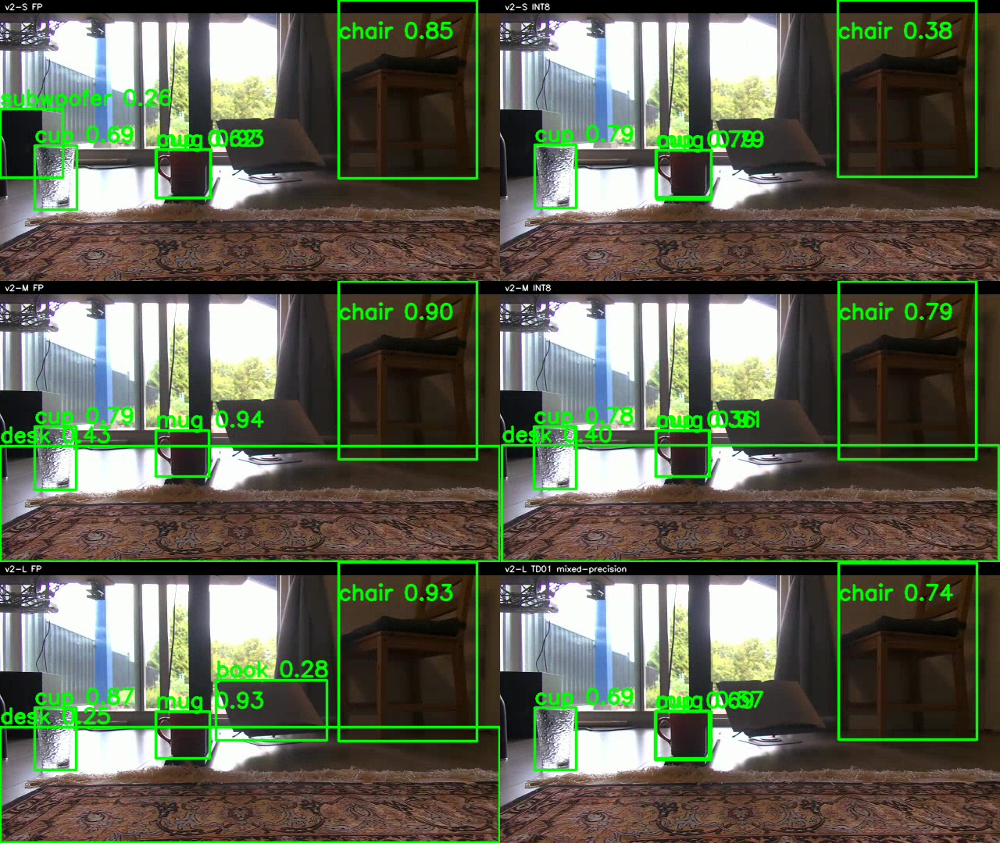

# Six-model YOLO-World comparison: retained evidence

**Canonical engineering write-up:** [Detector Comparison](https://jburo1.github.io/omniseer/verification/detector-comparison/).
That GitHub Pages page is the authoritative engineering narrative, results,
interpretation, and limitations. This repository directory is the retained
evidence and reproducibility index for that experiment.

## Directory contents

This study preserves the fixed-source, recalibrated 360° replay artifacts for
six final YOLO-World RKNN configurations, plus the supporting independent
physical-run presentation and summary. The controlled replay uses 1,222
repaired source frames; the physical-run grid is supporting end-to-end
case-study evidence and is not frame aligned.

- [Controlled replay video](evidence/controlled_replay_2x3.mp4) and its
  representative poster above.
- [Replay provenance](evidence/replay_provenance.json), six
  [replay JSONLs](evidence/replay_jsonl/), [visibility annotations](visibility.txt),
  and [comparison report](evidence/comparison_report.html) for recomputing the
  controlled metrics; [results.md](results.md) retains the detailed result
  table.
- [Physical-run presentation grid](evidence/physical_trials_grid_2x3.mp4) and
  public-safe [physical-run summary](physical_runs.yaml), including local
  manifest hashes, shared hardware, Git revision, container digest, and
  completion status. Except for the public v2-L FP RunBundle,
  [`v2l_fp_scene_1`](../../autonomy/v2l_fp_target_acquisition/README.md), the
  physical RunBundles and raw manifests remain retained local evidence; their
  reported runtime summaries are not independently recomputable from a public
  clone.
- [checksums.sha256](checksums.sha256) for tracked, publicly verifiable paths
  and [withheld_source_hashes.sha256](withheld_source_hashes.sha256) for the
  non-retained source-stream hash.

## Reproducibility boundary

The original replay provenance is unchanged. No inference, report generation,
or video rendering was rerun when this directory was consolidated. Consult the
[canonical write-up](https://jburo1.github.io/omniseer/verification/detector-comparison/)
for the engineering conclusions, controlled-versus-physical evidence boundary,
and limitations.
